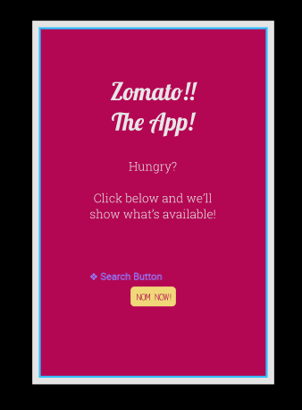
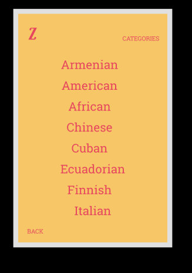
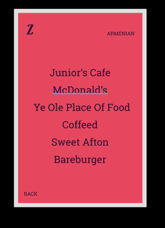
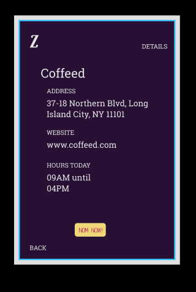

# Preston Pilot Interview

## Initial Thoughts & Plans

### Architecture

*Goal is to complete the app in about 5 - 10 hours.*

Realistically though it'll probably take about 10 to 20 since I'm unfamiliar with their API and how I should present it on the front end. Going to use NODEJSon the back-end and React on the front

### Server-Side

*Going to try to tackle the most accessible endpoints available*

This seems to be **CATEGORIES** and then **RESTAURANTS**. Based on the API documentation. Things like **Reviews & Photos** require partner access and I don't have much time for that. I'll have to assume that the user is in a given location so that I don't have to access every city. Though that could potentially be done on another iteration.

### Client-Side

*Then I'll get information and order it in the most accessible way*

*Once that's done I can work on presenting it in a more aesthethically pleasing way.*

Should look like below

Home | Cuisines | Restaurants | Restaurant Details
- | - | - | -
 |  |  | 

## Technical Questions

1. How long did you spend on this technical challenge? What would you add to your solution if you had more time?
-----
I ended up spending about 15 hours altogether on the solution - mostly getting hung up on refactoring before I should have,  react-router's new syntax and trying to implement axios' new library. Also spent way more time than I should have making wireframes. What can I say - I like visuals :)

******
2. What was the most useful feature that was added to the latest version of your chosen language? Please include a snippet of code that shows how you've used it.
------
The most useful feature is probably destructuring/spread syntax which I believe is a part of ES6. Instead of adding code to each prop in a React Component one simply adds it as object preceded by an ellipsis.

Ex: `{...object}`

Which turns this:

`<Category name={this.props.name} id={this.props.id} />`

Into this:

`<Category {...props} />`

Seems minimal but saves a lot of typing and helps to move data processing to the proper object.

3. How would you track down a performance issue in production? Have you ever had to do this?

I have - in this application!

The first iterations were making calls from each Component or causing re-renders which would call the API too many times. once I called the API 1000 times in a single call and couldn't get any data until the next day. In a real production setting I think I'd implement a logger first and make sure that was always running data back to the server. That way it'd be a bit easier to figure out what the symptoms of the larger problem were. In my experience, it seems to come down to either a poorly structured call or an unforeseen edge case - only way to know would be to start with the logs and test with some JSON afterward.

******
4. How would you improve the Zomato API that you just used?

A few things:
1. Allow calls to the restaurant endpoint to be batched
2. Restructure the Location endpoint a little differently so one could map to a specific city/area a bit easier
******
5. Please describe yourself using JSON.

~~~~~~
{
    name: 'Preston',
    hometown: 'Far Rockaway, New York',
    non_code_activities: [hiking, reading, running]
    bilingual: true,
    yearCoding: 4
}
~~~~~~
